# Tarea Evaluable 2.1 Dockerización de stack LAMP

## Paso 1
### Descargamos y preparamos las carpetas necesarias con el contenido.
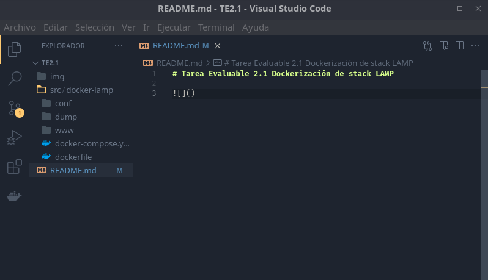

## Paso 2
### Creamos una imagen de Docker donde incluimos Apache y PHP 
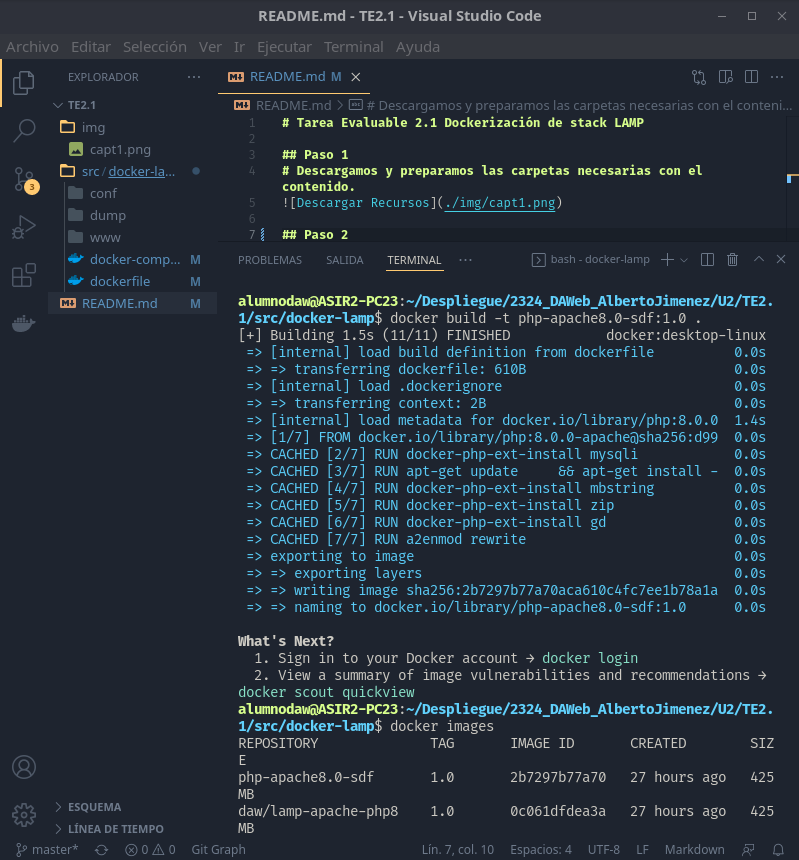
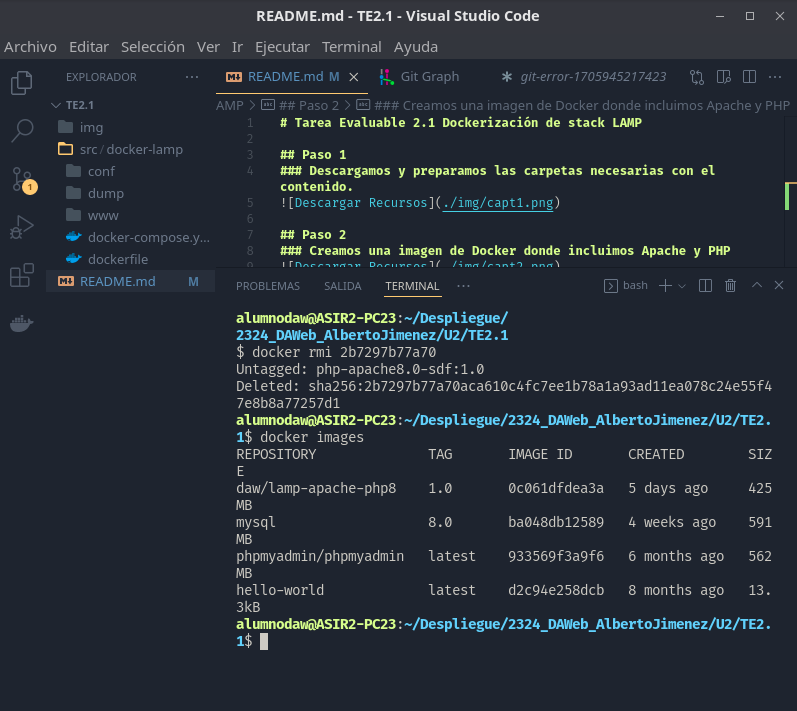

## Paso 3
### Creamos el fichero docker compose.yml.
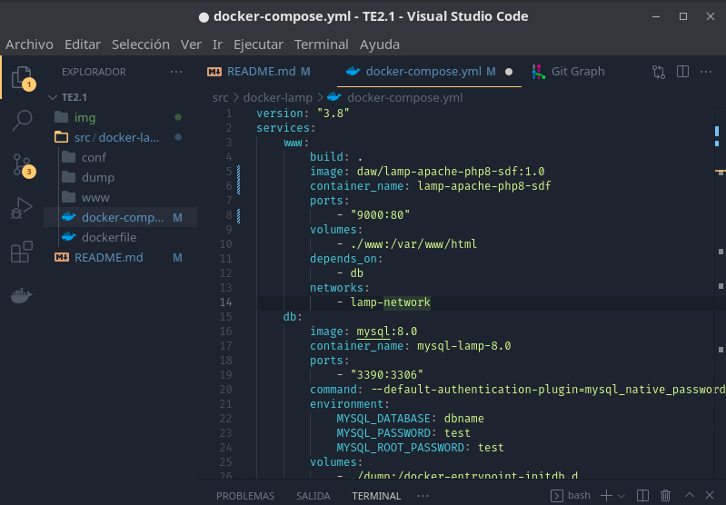
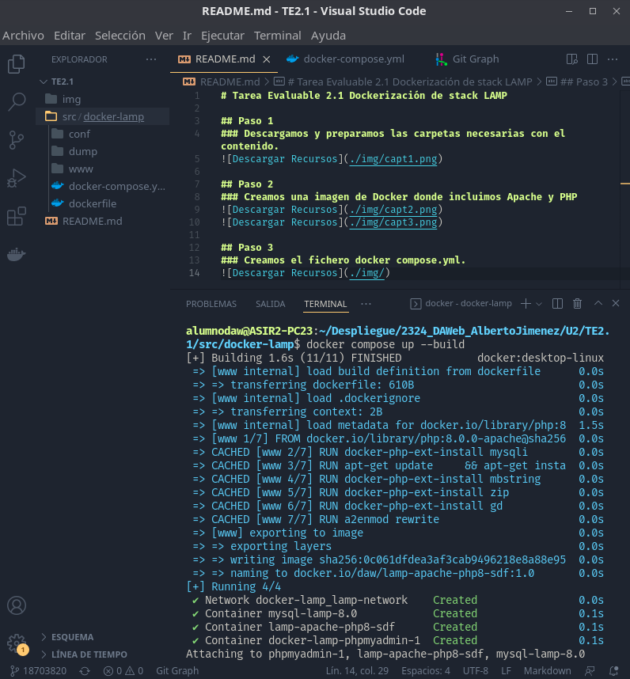
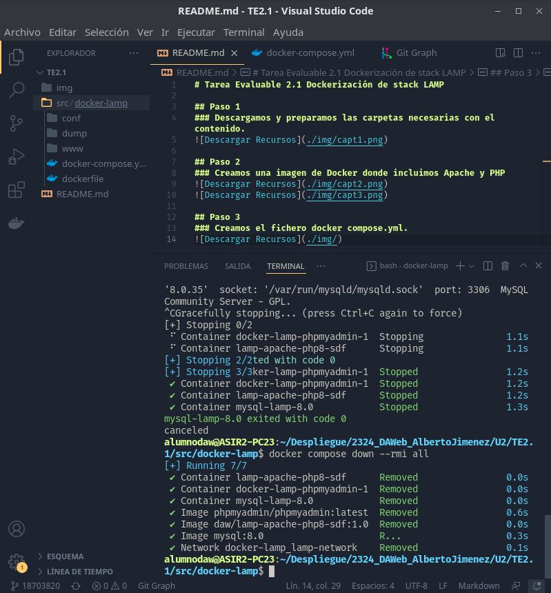

## Paso 4
### Definimos la network y lo enlazamos con www.
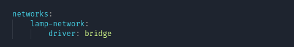
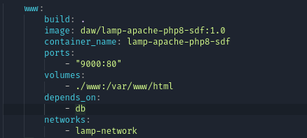

## Paso 5
### Definimos el servicio db para construir un contenedor en MySql.
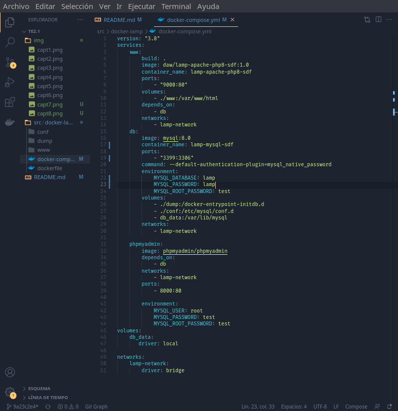
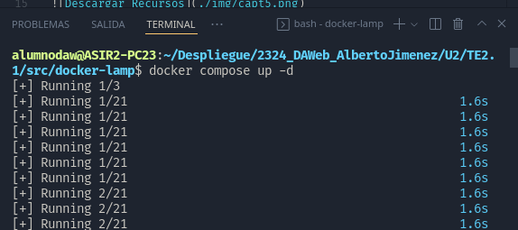
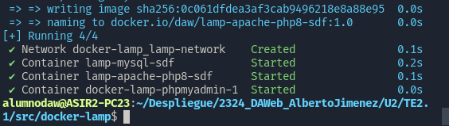
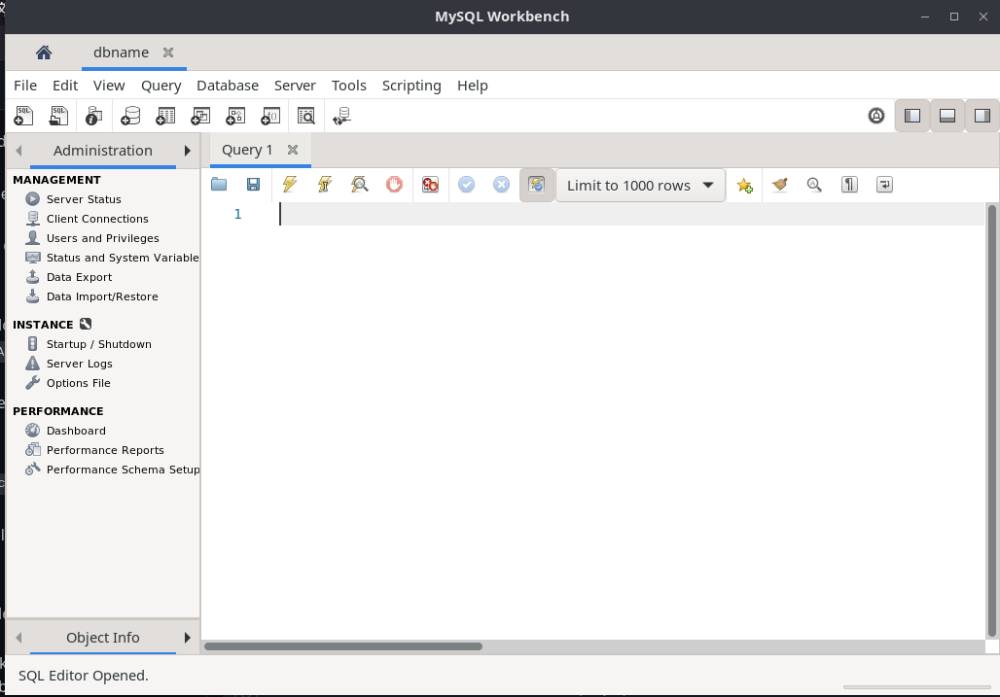
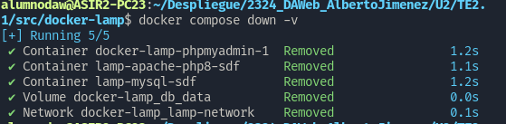
#### Red tipo bridge: es un dispositivo de interconexión de redes que conecta segmentos de red de diferentes topologías y arquitecturas

#### Red tipo lamp-network: LAMP es el stack de tecnologías más usado en la actualidad, todas ellas de código abierto, con un porcentaje de penetración que supera de largo el 50% de los sitios web.

## Paso 6
### Realizamos cambios en la zona del contenedor PHPMyAdmin.
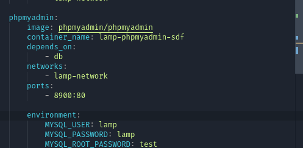

## Paso 7
### Definimos la precedencia de arranque de los contenedores, para que los servicios www y phpmyadmin deban esperar a que el servicio mysql esté en ejecución.

#### Levantamos el docker compose
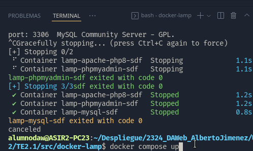
